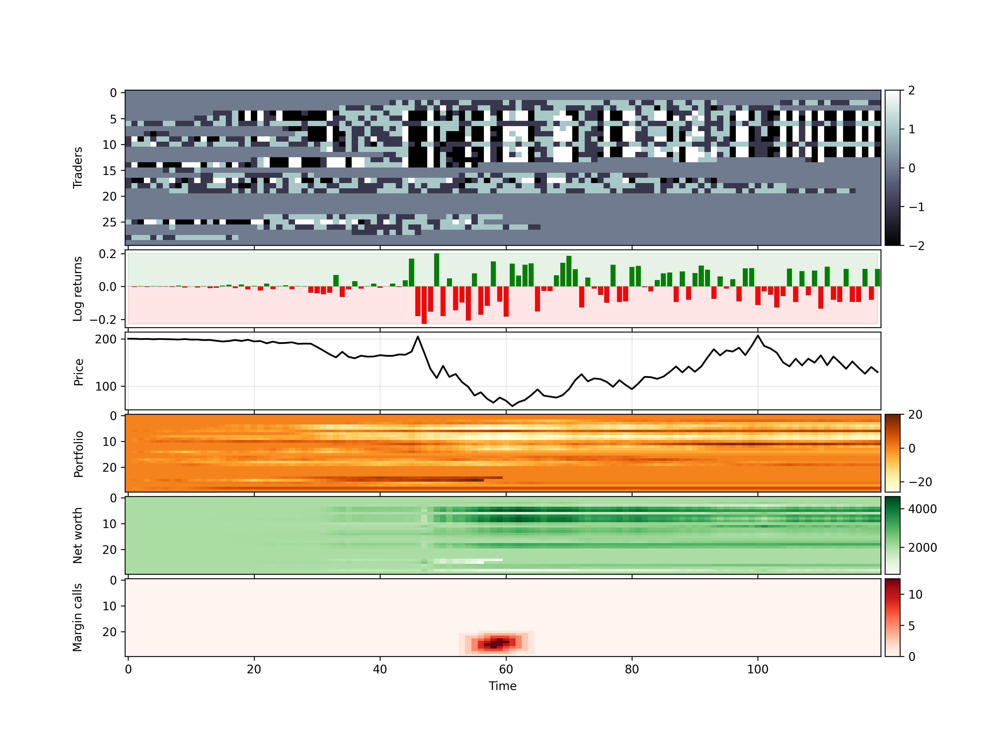
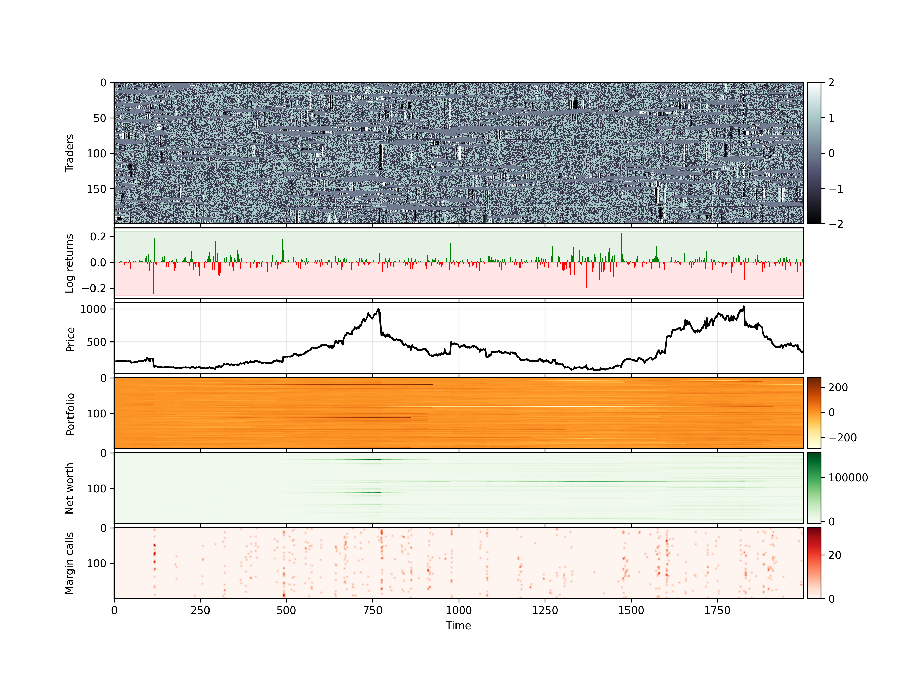

# ComplexSystems

Our project focuses on analysing stock market crash dynamics using a cellular automaton. This repository contains the code necessary to recreate our model, plots and simulation studies. You can run the basic model by executing the interactive python file in ```code/shared/wednesdaySPEED```. To reproduce specific plots or simulations, see the "Files and Folders" index below for the location of appropriate notebook.

Note that the data required to generate the plots involving the S&P 500 is not included in this submission. This is because the returns data used has been provided to us on the condition that it is not shared. If you wish to create these plots, please contact us and we can seek explicit permission from the data provider. 

## Files and Folders

- ```img/``` - the visualisations generated for the presentation
- ```data/``` - the data generated from simulations data, like .npy arrays
- ```other/``` - various unrelated files that are relevant to the Complex systems class but not related to the project
- ```code/``` - the code of the project

For the code part, over time we have realised that the best way to work with jupyter notebooks and simulatenously having version control is to have individual folders for each person. People can then put the code they work on in their own folder, which assures that there are not git conflicts since other members are not supposed to work on the files in someone elses folder. Instead they should import or, if not possible, copy them in their own repository. We found this to be the best way to avoid merge conflicts, which are very hard to deal with in jupyter notebooks.

- ```code/shared```:
    - ```wednesdaySPEED``` - the fast Numba implementation of our final algorithm. It is called wednesday as it was created on a wednesday and we were unable to find a better name
    - ```bartolozziSPEED``` - the fast Numba implementation of the original algorithm by Bartolozzi et al.
    - ```original_implementation``` - the original implementation of the algorithm by Bartolozzi et al.
    - ```analytic_tools``` - various functions and code snippets used throughout the project including methods for hurst exponent and thermodynamic fractality

- ```code/alex```:
    - ```3D_plot_generator``` - the file used to generate 3D plots of heat capacity and entropy of the system.
    - ```OTHER``` - the folder with all other code/functions used in exploration but never used for final submission/presentation.

- ```code/charel```
    - ```3Dplots_videos``` - used to generate 3D plots and videos / gifs
    - ```bartolozzi2004``` - first exploration of bartolozzis algorithm before implementing it in python files
    - ```bartolozziTEST``` - testing implemented the bartolozzi algorithm
    - ```CA_plots``` - used to generate plots with all data of the model
    - ```datacollapse``` - experimenting with collapsing all the crashes at one point and seeing whether metrics like eigenvectors from correlation matrix or mutual information matrix can be used as early warning signal
    - ```future_market_sim``` - experimenting with generating futures markets for various stocks. This was done to see if we can generate derivatives of stock that we could then measure the informatino transmision on
    - ```wednesdayTEST``` - testing our model
    - ```OTHER``` - collection of various files used throughout the project

- ```code/james```
    - ```bartolozzi2004.ipynb``` - recreation of the methods and diagrams from the original Bartolozzi paper 
    - ```crash_indic.py``` - first iteration crash indicator and associated simulation studies. There were significantly more studies here than included in the presentation. 
    -  ```presentation_plots.py``` - simulation studies and associated plots used in the application. Autocorrelation functions, distributions, simulations, hurst exponent application etc
    -  ```CA_distribution.py``` - a previous version of the model which makes use of fixed distributions of agents and early test of series stylised facts
    - ```OTHER``` - collection of other files, experiments and studies from the project. 


- ```code/zhiyu```
    - ```ZZ_Final``` - collection of system analysis: periodic boundary condition for the grid, fitting the cluster size distribution with power law with respect to different grid sizes, multifractal analysis from canessa and exploration of complexity measure with correlation matrix.
    - ```OTHER``` - collection of different analysis approaches


| Small | Large |
|------------|------------|
|  |  |

Yielding interesting phenomena

| Heat Capacity | Entropy |
|------------|------------|
|  |  |


## Acknowledgment

Entropy Estimators: https://github.com/gregversteeg/NPEET

## Presentation slides (with animation)

https://docs.google.com/presentation/d/1u3DZv6CPe8-uUDXZ-hRgJqaDLkvPnk9ZJOXSTKMUTGc/edit?usp=sharing
